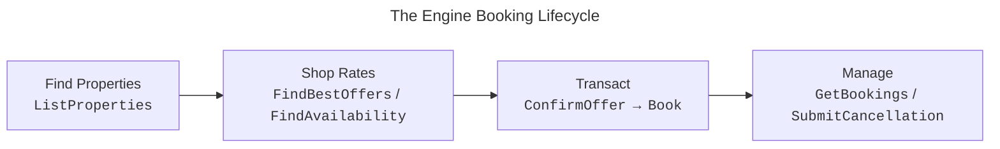
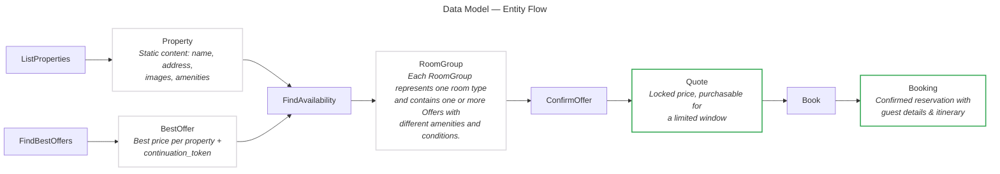

<!-- markdownlint-disable-next-line MD025 -->
# Build with the Omni API

The Omni API gives you programmatic access to Engine's hotel booking platform — the same technology powering Engine's own product, which serves thousands of businesses.
Integrate hotel shopping, pricing, and booking into your product through gRPC or HTTP/JSON interfaces, or refer your customers to a streamlined Engine checkout flow to complete and manage their booking.

<!-- markdownlint-capture -->
<!-- markdownlint-disable MD033 -->
<details markdown="block">
  <summary>
    Table of contents
  </summary>
  {: .text-delta }
1. TOC
{:toc}
</details>
<!-- markdownlint-restore -->

## What is the Omni API?

The Omni API gives you programmatic access to Engine's hotel booking platform.
Whether you're a travel platform adding hotels, a corporate perks provider building employee benefits, or a fintech provider expanding your offering, the Omni API provides the tools to ship a production-ready booking experience without building a travel technology infrastructure from scratch.

### What you get access to

Through the Omni API, your integration taps into:

* Property discovery and content (names, addresses, images, descriptions, amenities)
* Real-time rate shopping with best offers and availability details
* Full booking lifecycle including confirmation, cancellation preview, and cancellation
* Engine-branded folio (PDF) generation for real-time booking documentation

## Core concepts: the booking lifecycle

The Omni API organizes lodging transactions into four sequential stages.
Unlike e-commerce where inventory is stable, hotel availability changes in real time.
The API architecture simplifies travel for your customers.



* **Find Properties** &mdash; `ListProperties` looks up by geo, address, or text.
* **Shop Rates** &mdash; `FindBestOffers` and `FindAvailability` return pricing and room details.
* **Transact** &mdash; `ConfirmOffer` locks the rate, then `Book` confirms.
* **Manage** &mdash; `GetBookings`, `SubmitCancellation`, and folio generation handle the post-booking lifecycle.

### Key data relationships

Each step in the lifecycle produces a data object that feeds into the next.
There are two entry points into the shopping flow — `ListProperties` for property data without pricing, or `FindBestOffers` when pricing is needed to pick a property — but both converge at `FindAvailability` before booking.
Understanding this chain is essential for building a correct integration.



* **Stable** — static content that does not change between requests.
* **Confirmed** — pricing is locked for a limited window.

{: .api }
> **How `continuation_token` works**
>
> `FindBestOffers` returns a `continuation_token` with each [BestOffer].
> Pass this token to [FindAvailability][LodgingShoppingService.FindAvailability] to retrieve detailed room groups and offers for that property.
> Alternatively, you can call [FindAvailability][LodgingShoppingService.FindAvailability] directly with a property ID — the token simply carries shop criteria forward for more accurate results.

## Example: get the best price for hotels in a given area

The Omni API is offered over **gRPC** (protocol buffers) and **HTTP/JSON**.
Both interfaces cover the same booking lifecycle, but gRPC can offer lower latency, smaller payloads, and access to streaming RPCs not exposed over HTTP/JSON.
Authentication is via Mutual TLS (mTLS) on both.
Here's a sample `FindBestOffers` call over gRPC — returning the lowest-priced offer per property near a point of interest, for a given stay:

```bash
grpcurl -protoset descriptor_set.desc \
  -key /path/to/private.key \
  -cert /path/to/cert.pem \
  -d '{
      "request": {
          "criteria": {
              "radius": {
                  "coordinates": {
                      "latitude": 30.267153,
                      "longitude": -97.743057
                  }
              },
              "stay": {
                  "check_in": "2026-08-25",
                  "check_out": "2026-08-26",
                  "room_count": 1,
                  "guest_count": 2
              }
          },
          "page_size": 3
      }
  }' \
  partner-api.engine.com:443 \
  engine.shop.lodging.api.v1.LodgingShoppingService.FindBestOffers
```

```json
{
  "offers": [
    {
      "property": {
        "property": {
          "id": "P0000000000000108984",
          "name": "Hampton Inn & Suites Austin @ The University / Capitol",
          "physicalAddress": {
            "addressLine": ["1701 Lavaca St"],
            "locality": "Austin",
            "administrativeArea": "TX",
            "postalCode": "78701",
            "countryCode": "US"
          },
          "coordinates": { "latitude": 30.279406792164, "longitude": -97.740873555225 },
          "starRating": "2.50",
          "checkInTime": "16:00",
          "checkOutTime": "12:00"
        },
        "distance": { "value": 0.2323158267289017 }
      },
      "bestOffer": {
        "continuationToken": "v0_wV4DE3rLvChwvmQSAQdArCJLITEp...",
        "bestOffer": {
          "propertyId": "P0000000000000108984",
          "price": { "price": { "total": { "currencyCode": "USD", "value": "[hidden]" } } },
          "offerAmenities": {
            "freeBreakfast": "AMENITY_AVAILABILITY_UNAVAILABLE",
            "freeParking": "AMENITY_AVAILABILITY_UNAVAILABLE"
          },
          "conditions": {
            "cancelConditions": [
              { "afterTimestamp": "2026-05-05T23:59:00-05:00", "isAllowed": true }
            ]
          }
        },
        "isRefundableAvailable": true,
        "isLoyaltyAvailable": true,
        "isFreeBreakfastAvailable": true
      }
    }
  ]
}
```

## Next step: choose your integration path

The Omni API offers two integration approaches, depending on how much of the booking experience you want to build yourself:

* **[Omni Swift]** — Turnkey deep linking.
  You build the discovery experience, then redirect customers to a co-branded Engine checkout.
  Engine handles payment, confirmation, cancellations, and post-booking support.
  Fastest time to market.
* **[Omni Halo]** — Full API integration.
  Build shopping, checkout, payments, and management entirely within your platform via gRPC or HTTP/JSON.
  Complete control over every screen.

Not sure which path is right?
See the side-by-side comparison on [Integration paths], or contact [omni-partnerships@engine.com](mailto:omni-partnerships@engine.com).
