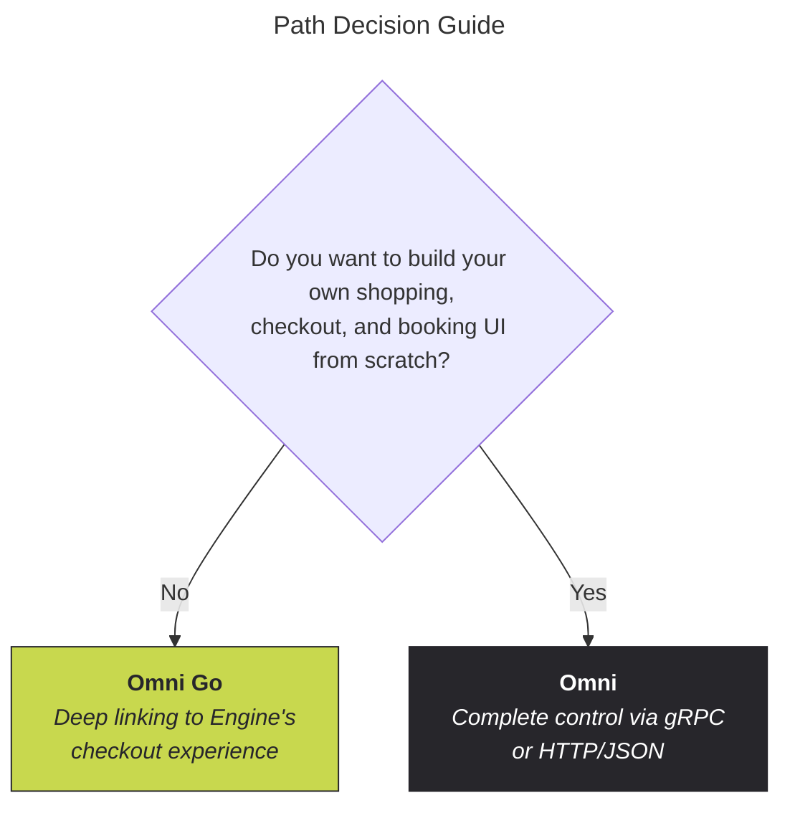

<!-- markdownlint-disable-next-line MD025 -->
# Integration paths

The Omni API offers two integration approaches — [Omni Go] and [Omni].
Choosing the right path early is critical — it determines your architecture, timeline, and engineering scope.

<!-- markdownlint-capture -->
<!-- markdownlint-disable MD033 -->

  

    Table of contents
  

  {: .text-delta }
1. TOC
{:toc}

<!-- markdownlint-restore -->

## Path decision guide

## The two paths

### Omni Go — turnkey deep linking

Generate deep links to Engine's checkout experience.
You control hotel discovery, while Engine handles room selection, checkout, payments, and cancellations.

[Learn more about Omni Go →][Omni Go]

### Omni — full API integration

Full control over shopping, booking, and management via gRPC or HTTP/JSON.
Build the entire experience within your platform.

[Learn more about Omni →][Omni]

## Side-by-side comparison

|                       | Omni Go                                                     | Omni                                               |
|-----------------------|-------------------------------------------------------------|----------------------------------------------------|
| **What you build**    | Discovery UI + redirect to Engine for checkout              | Full end-to-end booking experience                 |
| **Payment handling**  | Engine handles payments                                     | You handle payments & compliance                   |
| **UI control**        | Discovery: yours. Checkout: Engine-hosted                   | Complete control over every screen                 |
| **Post-booking**      | Engine manages cancellations & disputes                     | You manage via API                                 |
| **Best for**          | Fast time-to-market, non-travel-native                      | Travel platforms, full brand control               |
| **API surface**       | Content + deep link URL construction                        | Content, Shopping, Booking, Management             |

## Not sure which to choose?

Contact [omni-partnerships@engine.com](mailto:omni-partnerships@engine.com) and our team will help you align on the right approach for your product, timeline, and engineering scope.
