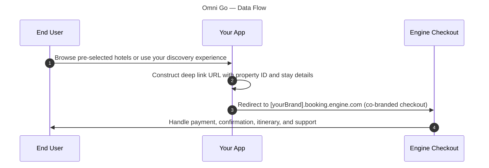

<!-- markdownlint-disable-next-line MD025 -->
# Omni Go

Engine manages the transaction lifecycle for your customers' bookings.
You build the discovery experience, then redirect users to a co-branded checkout experience via deep links.
Engine handles checkout, payments, cancellations, disputes, and post-booking support.
Depending on your customer profile, customers may be offered the opportunity to create an account with Engine to manage their regular travel.

<!-- markdownlint-capture -->
<!-- markdownlint-disable MD033 -->

  

    Table of contents
  

  {: .text-delta }
1. TOC
{:toc}

<!-- markdownlint-restore -->

## How it works

1. **User browses** → Your app displays pre-selected hotel options for a given event, or a discovery experience that suits your use case.
2. **User selects** → Your app constructs a deep link URL with property ID and stay details.
3. **Redirect** → After selecting a property, the user is sent to `[yourBrand].booking.engine.com`, a co-branded checkout page, with or without dates and guests provided by your app.
4. **Engine handles checkout** → Payment, confirmation, itinerary, and support are provided by Engine's platform.

## What you build

### 1. Discovery experience

Display pre-selected properties for a specific event, or build your own discovery or browsing UI to help users find hotels.
This can be as simple as a curated list or as rich as a full discovery interface — it's entirely your design.
Use `ContentService.ListProperties` to look up properties by geo, address, or freeform text and power that UI.

### 2. Deep link construction

When the user selects a property, construct a URL that sends them to Engine's checkout experience to complete the booking at that property.
Dates and guest counts can be provided by your app or selected by the user prior to booking.
Three deep link patterns are available:

* **Co-branded checkout page** — Route users to a co-branded booking flow for the selected property.
  Customers that have existing Engine accounts will have the opportunity to login to complete the booking, or complete the booking as a guest.
* **Property booking** — For partners with joint Engine customers, route users to a specific property within the Engine platform at `members.engine.com` with dates and guest count.
* **Groups & RFP** — Direct to the groups experience on `groups.engine.com` with location and date context.

{: .attention }
**That's the build scope.**
No payment forms, no PCI compliance, no cancellation logic, no post-booking support — Engine handles all of that.
Your team will need mTLS to call `ContentService.ListProperties` for property data; everything from checkout onward is Engine's responsibility.
Full URL patterns, parameter tables, and code examples are in the [Deep linking] guide.

## API services used

| Service / RPC                                  | Purpose                                                                                                               |
|------------------------------------------------|-----------------------------------------------------------------------------------------------------------------------|
| `ContentService.ListProperties`                | Retrieve property listings by geo-coordinates, postal address, or freeform text to populate your discovery experience |

Checkout, payments, cancellations, and post-booking support are handled entirely by Engine.
No shopping or booking lifecycle API calls are required for Omni Go.

## Onboarding roadmap

### 01 — Partnership & planning

Contact [omni-partnerships@engine.com](mailto:omni-partnerships@engine.com).
Sign the partnership agreement, confirm Omni Go as your integration path, and receive your partner slug.

**Done when:** Partnership agreement signed, partner slug issued.

### 02 — Sandbox development

Provision sandbox mTLS certificates, integrate `ContentService.ListProperties` to power your discovery experience, then construct deep link URLs.
Test that links correctly pre-fill property, dates, room count, and guest count on the co-branded Engine checkout page.

**Done when:** Content API integrated, deep links working correctly, discovery UI complete, internal QA passed.

### 03 — UAT & certification

Verify deep links across browsers and devices.
Confirm correct property routing, date handling, and edge cases (invalid IDs, past dates).
Submit results for Engine team review.

**Done when:** All UAT scenarios pass, Engine team signs off.

### 04 — Production & go-live

Switch deep links to production URLs, soft-launch with a subset of users, then roll out to 100%.

**Done when:** Live traffic flowing, links routing correctly.

## Get started

To begin the partnership process, contact [omni-partnerships@engine.com](mailto:omni-partnerships@engine.com) directly.

To compare with the full-API integration path, see [Omni].
