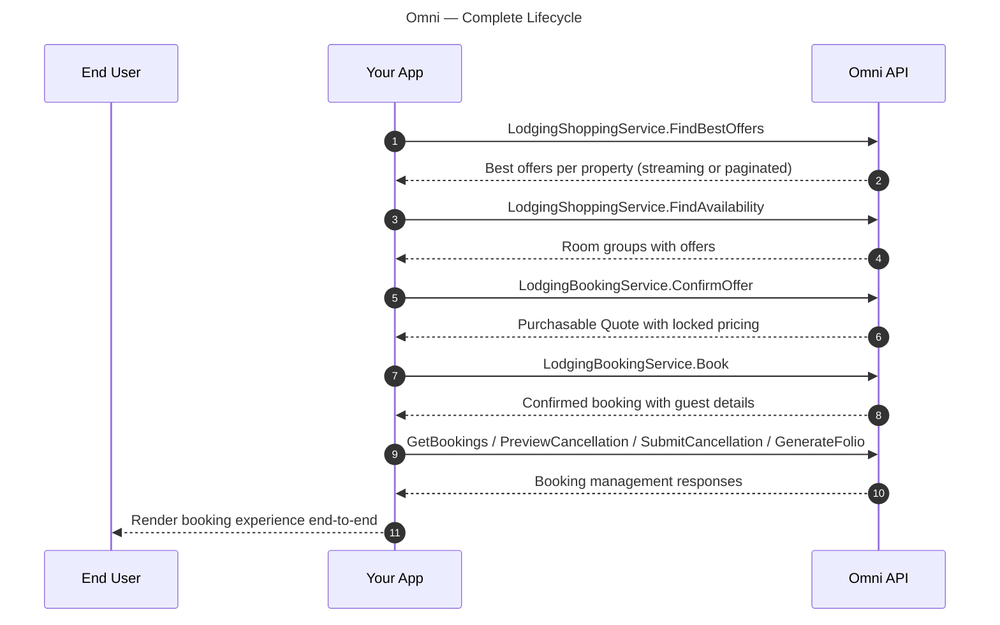

<!-- markdownlint-disable-next-line MD025 -->
# Omni

Full control over the hotel booking experience.
Build shopping, checkout, payments, and post-booking management entirely within your platform using the complete Omni API surface via gRPC or HTTP/JSON.

<!-- markdownlint-capture -->
<!-- markdownlint-disable MD033 -->

  

    Table of contents
  

  {: .text-delta }
1. TOC
{:toc}

<!-- markdownlint-restore -->

{: .warning }
**Higher complexity.**
A full Omni API integration requires significantly more engineering investment.
Your team handles mTLS authentication, rate shopping, offer confirmation, booking, payment processing, cancellation management, and error handling.

## How it works

1. **Shop Rates** → `LodgingShoppingService.FindBestOffers` → Best offers per property (streaming or paginated)
2. **Get Availability** → `LodgingShoppingService.FindAvailability` → Room groups with offers
3. **Confirm Offer** → `LodgingBookingService.ConfirmOffer` → Purchasable `Quote` with locked pricing
4. **Book** → `LodgingBookingService.Book` → Confirmed booking with guest details
5. **Manage** → `GetBookings` \| `PreviewCancellation` \| `SubmitCancellation` \| `GenerateFolio`

## API services used

| Service / RPC                                          | Purpose                                                                       |
|--------------------------------------------------------|-------------------------------------------------------------------------------|
| `LodgingShoppingService.FindBestOffers`                | Get best offer per property (streaming or paginated)                          |
| `LodgingShoppingService.FindAvailability`              | Get room groups and offers for a property                                     |
| `LodgingBookingService.ConfirmOffer`                   | Validate pricing, generate purchasable Quote                                  |
| `LodgingBookingService.Book`                           | Confirm booking with guest and payment details                                |
| `LodgingBookingService.GetBookings`                    | Retrieve booking details                                                      |
| `LodgingBookingService.PreviewCancellation`            | Preview refund amount before cancelling                                       |
| `LodgingBookingService.SubmitCancellation`             | Process cancellation, refund to original payment                              |
| `LodgingBookingService.GenerateFolio`                  | Generate Engine-branded PDF documentation                                     |

{: .warning }
**Common pitfall: stale availability.**
Availability of offers changes in real time.
Do not cache rates.
Always use `ConfirmOffer` to validate pricing before booking.
Stale offers will result in booking failures.

## Onboarding roadmap

A full Omni API integration is a deeper integration.
Expect a longer timeline to account for mTLS setup, full booking lifecycle implementation, and comprehensive UAT.

| Phase   | Stage          | Typical duration |
|---------|----------------|------------------|
| Phase 1 | Partnership    | 1–2 weeks        |
| Phase 2 | Sandbox dev    | 4–10 weeks       |
| Phase 3 | UAT & cert     | 3–5 days         |
| Phase 4 | Go-live        | 1–2 days         |

### 01 — Partnership & planning

Contact [omni-partnerships@engine.com](mailto:omni-partnerships@engine.com).
Complete the partnership agreement form.
Discuss your planned architecture, payment processing approach, and obtain sandbox mTLS certificates.

**Done when:** Partnership agreement signed, sandbox mTLS certificates issued, architecture reviewed by Engine team.

### 02 — Sandbox development

Build against the sandbox environment.
Set up mTLS authentication, implement rate shopping, offer confirmation, booking, and post-booking management.
Handle error scenarios, cancellation flows, and edge cases.

**Done when:** Full booking lifecycle implemented, error handling complete, internal QA passed, ready for UAT.

### 03 — UAT & certification

Run required test scenarios: standard booking flow, price changes during checkout, sold-out inventory, cancellation with refund preview, and booking retrieval.
Submit results for Engine team review.

**Done when:** All UAT tests pass, Engine team signs off.

### 04 — Production & go-live

Receive production mTLS certificates.
Soft-launch with a subset of users, monitor error rates and rate limit usage, then roll out to 100%.

**Done when:** Live traffic flowing with healthy metrics, monitoring in place.

## Get started

To begin the partnership process, contact [omni-partnerships@engine.com](mailto:omni-partnerships@engine.com) directly.

Next steps:

* [Integration guide] — protocol setup, authentication, and request/response examples
* [User journeys] — full process map and per-endpoint guidance
* [Omni Go] — compare with the turnkey deep linking path
