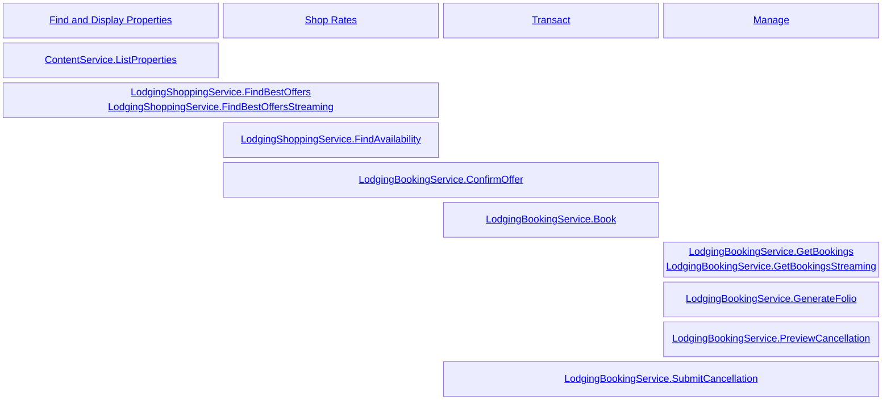
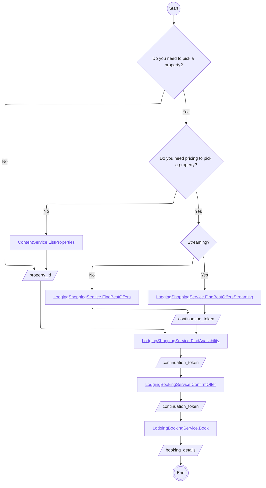

{::options toc_levels="1..3" /}

<!-- markdownlint-disable-next-line MD025 -->
# Lodging User Journeys

<!-- markdownlint-capture -->
<!-- markdownlint-disable MD033 -->

  

    Table of contents
  

  {: .text-delta }
1. TOC
{:toc}

<!-- markdownlint-restore -->

## Process Map

The following diagram lays out the available API endpoints across the four main actions your customer will take...

* Find and Display Properties: Deciding where to stay
* Shop Rates: Of the options available, which combination of location, price, bedding, and amenities will be purchased
* Transact: Book a stay or cancel a previously booked stay
* Manage: See details of their bookings, or make modifications

## Process Flow

The following flowchart (collapsed by default) can help you make decisions about which of the available APIs you may need to use, and in which order.

<!-- markdownlint-capture -->
<!-- markdownlint-disable MD033 -->

  

    Visual Flowchart
  

<!-- markdownlint-restore -->

## Find and Display Properties

### Find

#### ListProperties

{: .api}
<!-- markdownlint-disable MD033 -->
> `ContentService.ListProperties`[gRPC][ContentService.ListProperties] [Swagger](/swagger-ui/index.html#/ContentService/ContentService_ListProperties)
>
> _An endpoint that allows a client to enumerate the properties nearest a point of interest_

Given one of the following...

* [A lat/long geo coordinate][GeoPoint]
* [A structured address][PostalAddress]
* A textual description of the point of interest

...find properties [within a given radius][RadiusSearch].

{: .attention}
Freeform-text search is offered as a best-effort mechanism for identifying your point of interest.
In cases where the input text is too general or ambiguous, a poor center point may be selected, and the responsive properties may be inappropriate.
If at all possible, it is recommended to use Coordinate- or Address-based search.

The `ListProperties` endpoint does not consider availability in its results.
It is most suitable when the final details of the stay (dates, number of guests, number of rooms) are not yet known.
It is also substantially more performant and has much higher rate limits than the companion shopping endpoints.

To find properties with availability suitable for your stay, see [Selecting a Property With Pricing][FindBestOffers].

## Shop Rates

### Selecting a Property

The FindBestOffers endpoints provide means to locate properties near a point of interest that have availability according to the parameters of your stay.
The returned [BestOffer] is an aggregation of the attributes on the rates we have found, as well as the details of the lowest-priced offer available.
The `continuation_token` on the [BestOffer] may be used to [FindAvailability] for the property it represents, or it may be used to [ConfirmOffer] and/or [Book] the lowest-priced offer directly.

If you do not need pricing to select a property, see [Find and Display Properties][ListProperties]

{: .attention}
The `is_*_available` attributes of a [BestOffer] indicate that at least one available rate for the responsive property has the described attribute.
A true value here does not indicate that the [Offer] described in the `best_offer` field has this attribute.
A false value here does not indicate that no [Offer] with the desired attribute will be found via a subsequent [LodgingShoppingService.FindAvailability] call.

#### FindBestOffersStreaming

{: .api}
<!-- markdownlint-disable-next-line MD033 -->
> `LodgingShoppingService.FindBestOffersStreaming`[gRPC][LodgingShoppingService.FindBestOffersStreaming] <del>Swagger</del>
>
> _An endpoint that returns all [Property] data independently of [BestOffer] data_

[BestOffer] data is returned as it becomes available, allowing early rendering and processing of records.
It is possible to receive multiple [BestOffer] records for a single [Property] as new details are discovered.
Additional [BestOffer] records will appear if any of the `is_*_available` fields changes from `false` to `true` or when a new, lower price is discovered.
In all cases, the last [BestOffer] received replaces any received prior.
If a [Property] has no availability, no [BestOffer] for that property may be returned.

The streaming endpoint for FindBestOffers is only available via the [gRPC][gRPC API Definition] interfaces.

#### FindBestOffers

{: .api}
<!-- markdownlint-disable-next-line MD033 -->
> `LodgingShoppingService.FindBestOffers`[gRPC][LodgingShoppingService.FindBestOffers] [Swagger](/swagger-ui/index.html#/LodgingShoppingService/LodgingShoppingService_FindBestOffers)
>
> _An endpoint that returns pairs of [Property] and [BestOffer] records_

Optionally, [Property] records where there is no availability may be excluded via the `include_properties_with_no_availability` flag.
Unlike the [Streaming][FindBestOffersStreaming] offering, all results are deduplicated in the single-page response.

### Getting Available Offers for a Property

#### FindAvailability

{: .api}
<!-- markdownlint-disable-next-line MD033 -->
> `LodgingShoppingService.FindAvailability`[gRPC][LodgingShoppingService.FindAvailability] [Swagger](http://127.0.0.1:4000/swagger-ui/index.html#/LodgingShoppingService/LodgingShoppingService_FindAvailability)
>
> _An endpoint that allows a client to list the rates available for a [Property], broken down by room type and amenity_

A FindAvailability request can be initiated with...

* A [Property] ID, as identified via [ContentService.ListProperties][ListProperties] results, along with the [Criteria][FindAvailabilityPropertyRequest] for your stay.
* A `continuation_token` from a [BestOffer] via [LodgingShoppingService.FindBestOffers][FindBestOffers] results.

The response of this endpoint is a list of [RoomGroup] objects, each with the details of that group, and a list of [Offer] objects.

{: .attention}
A [RoomGroup] uniquely identifies a type of room in a [Property].
For example, if a [Property] has 16 rooms with the same bedding, amenities, and description, those 16 rooms are in a single group.
However, if a room has a unique name, like "The Honeymoon Suite", it would be in a separate [RoomGroup], even if it shared the other attributes of the 16 rooms.

## Transact

### Confirming Availability and Conditions

#### ConfirmOffer

{: .api}
<!-- markdownlint-disable-next-line MD033 -->
> `LodgingBookingService.ConfirmOffer`[gRPC][LodgingBookingService.ConfirmOffer] [Swagger](/swagger-ui/index.html#/LodgingBookingService/LodgingBookingService_ConfirmOffer)
>
> _An endpoint that allows a client to confirm pricing, availability, and conditions of an [Offer] prior to purchasing_

Given a `continuation_token` from an [Offer] retrieved from the [RoomGroup] in the results of [FindAvailability], retrieve a purchasable [Quote].

The [Quote] includes the full details of the stay, including which actions may be taken on a [BookingDetails] if the [Quote] is purchased.

{: .attention}
Availability of offers changes in real time.
Occasionally, changes to availability may cause an [Offer] to no longer be available, or cause the price of that [Offer] to change.

### Booking the Stay

#### Book

{: .api}
<!-- markdownlint-disable-next-line MD033 -->
> `LodgingBookingService.Book`[gRPC][LodgingBookingService.Book] [Swagger](/swagger-ui/index.html#/LodgingBookingService/LodgingBookingService_Book)
>
> _An endpoint that allows a client to purchase an [Offer]_

Given one of the following a `continuation_token` from [ConfirmOffer][ConfirmOffer], create a [BookingDetails] and purchase your stay.

At this point, you must provide the details of the [RoomGuests] for the stay.

{: .attention}
Engine allows you to specify `additional_guests` for your stay who may check-in without the primary guest present.
While it is rare, some properties do not honor the presence of additional guests and require the primary guest to be present to check in.

A [BookingDetails] may optionally carry [BookingMetadata].
[BookingMetadata] is opaque and is not inspected by Engine.
If the [BookingMetadata] is marked as `external`, the item will be displayed on the Folio and invoice (if appropriate).

### Canceling a Booking

#### SubmitCancellation

{: .api}
<!-- markdownlint-disable-next-line MD033 -->
> `LodgingBookingService.SubmitCancellation`[gRPC][LodgingBookingService.SubmitCancellation] [Swagger](/swagger-ui/index.html#/LodgingBookingService/LodgingBookingService_SubmitCancellation)
>
> _An endpoint to attempt to Cancel a booking_

Given a `booking_id` from a call to [Book], attempt to cancel the Booking.
If the cancellation succeeds, details of the [Refund] are returned.
Refunds are made to the original payment method.

{: .attention}
Prior to submitting your cancellation, you may wish to [review][PreviewCancellation] the refund amount and conditions of cancellation.

## Manage

### Getting Details of a Prior Booking

#### GetBookingsStreaming

{: .api}
<!-- markdownlint-disable-next-line MD033 -->
> `LodgingBookingService.GetBookingsStreaming`[gRPC][LodgingBookingService.GetBookingsStreaming] <del>Swagger</del>
>
> _An endpoint to retrieve the details of one or more [BookingDetails]_

The streaming version of this endpoint is only available via the gRPC API.
This endpoint will return a unified stream of results for the requested bookings with both results and errors.
For each result, consult the `booking_details` and/or `error` field.

#### GetBookings

{: .api}
<!-- markdownlint-disable-next-line MD033 -->
> `LodgingBookingService.GetBookings`[gRPC][LodgingBookingService.GetBookings] [Swagger](http://127.0.0.1:4000/swagger-ui/index.html#/LodgingBookingService/LodgingBookingService_GetBookings)
>
> _An endpoint to retrieve the details of one or more [BookingDetails]_

This endpoint returns a single page of [BookingDetails] records.
If an error occurs, the error response will include the problematic records, if possible.
For a unified view of records and errors, see [GetBookingsStreaming]

### Generate an Engine-branded Folio

{: .api}
<!-- markdownlint-disable-next-line MD033 -->
> `LodgingBookingService.GenerateFolio`[gRPC][LodgingBookingService.GenerateFolio] [Swagger](http://127.0.0.1:4000/swagger-ui/index.html#/LodgingBookingService/LodgingBookingService_GenerateFolio)
>
> _An endpoint to Generate a PDF Folio representing a [BookingDetails]_

This endpoint provides an Engine-branded PDF "Folio" of your [BookingDetails].
This Folio is not an invoice.

### Confirming Cancellability and Refund Amount

#### PreviewCancellation

{: .api}
<!-- markdownlint-disable-next-line MD033 -->
> `LodgingBookingService.PreviewCancellation`[gRPC][LodgingBookingService.PreviewCancellation] [Swagger](http://127.0.0.1:4000/swagger-ui/index.html#/LodgingBookingService/LodgingBookingService_PreviewCancellation)
>
> _An endpoint to confirm the amount of [Refund] that will be received upon cancellation_

This endpoint confirms that cancellation is still possible and returns the amount of Refund you will receive after any penalties should the cancellation succeed.
To submit and process your cancellation, see [SubmitCancellation].

{: .attention}
Many [Offer] records have [Conditions] that dictate penalties that may be applied to modifications or cancellation.
These [Condition] have dates associated with them, such that an [Offer] may be fully refundable when purchased, but partially refunded at a later date.

[Book]: #booking-the-stay
[ConfirmOffer]: #confirming-availability-and-conditions
[FindAvailability]: #getting-available-offers-for-a-property
[FindBestOffers]: #selecting-a-property
[FindBestOffersStreaming]: #findbestoffersstreaming
[ListProperties]: #find-and-display-properties
[PreviewCancellation]: #previewcancellation
[SubmitCancellation]: #submitcancellation
[GetBookingsStreaming]: #getbookingsstreaming
