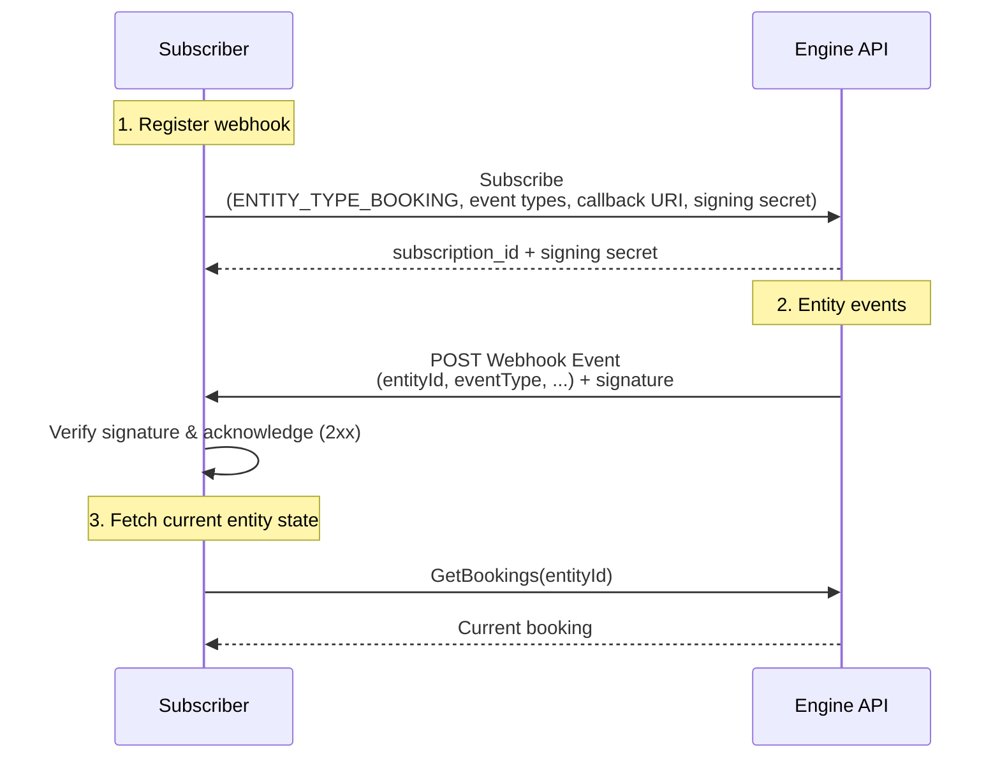

{::options toc_levels="1..3" /}

<!-- markdownlint-disable-next-line MD025 -->
# Webhooks

<!-- markdownlint-capture -->
<!-- markdownlint-disable MD033 -->
<details markdown="block">
  <summary>
    Table of contents
  </summary>
  {: .text-delta }
1. TOC
{:toc}
</details>
<!-- markdownlint-restore -->

## Getting Started

Engine's API can notify external systems when something changes for an entity - for example when a [booking][EntityType] is updated or canceled. Engine currently supports webhooks as a notification mechanism. A system creates a **subscription** that specifies the event types to be notified of and a URI for delivery. When a matching event occurs, Engine delivers a signed [Event] payload to a subscription's HTTPS callback URI.

Engine event notifications include detail about the type of entity that the event references (e.g. booking), the type of event (e.g. updated), and an id for the entity so the receiver of the notification can look up the associated data entity the event describes. The event notification does not include specific details about data records (e.g. which specific data elements of a booking were updated). A "booking updated" event, for example, includes the booking id (in the `entityId` field) and requires the caller to subsequently fetch the data about the booking from `GetBookings` ([gRPC][LodgingBookingService.GetBookings] · [REST][GetBookings (REST)]{:target="_blank" rel="noopener"}) to find its current state.

## Concepts

| Concept            | Description                                                                                                                                                                                                                                                                                                                              |
|--------------------|------------------------------------------------------------------------------------------------------------------------------------------------------------------------------------------------------------------------------------------------------------------------------------------------------------------------------------------|
| **Subscription**   | The unit created and managed by the caller. It binds one [entity type][EntityType], a set of [event types][EventType], and a delivery URI (HTTPS required). See [Subscription].                                                                                                                                                          |
| **Entity type**    | The entity domain a subscription applies to, e.g. `ENTITY_TYPE_BOOKING`. A subscription's entity type is fixed at creation and cannot be changed - create a new subscription to target a different entity type. See [EntityType].                                                                                                        |
| **Event type**     | The change that triggers delivery, e.g. `EVENT_TYPE_UPDATED` or `EVENT_TYPE_CANCELED`. Subscribe to a specific set, or to **all** event types for the entity type by omitting the list. See [EventType].                                                                                                                                 |
| **Event**          | The JSON payload delivered to the subscription's callback URI. See [Event] and the example below.                                                                                                                                                                                                                                        |
| **Signing secret** | A Base64-encoded HMAC (see [this Wikipedia article](https://en.wikipedia.org/wiki/HMAC)) key used to sign deliveries. Provided by the caller in subscribe or rotate API requests or generated by the API if not provided by the caller. Returned once by the API at subscribe time (or on rotation) and used to verify inbound payloads. |

## Example event notification

An example [Event] notification payload sent to the URI on a subscription contains the following data fields:

* `entityId` - identifier of the entity the event occurred for (e.g. the booking id).
* `entityType` - the entity domain the event applies to, e.g. `ENTITY_TYPE_BOOKING`. See [EntityType].
* `eventType` - the change that occurred for the entity, e.g. `EVENT_TYPE_UPDATED` or `EVENT_TYPE_CANCELED`. See [EventType].
* `eventTimestamp` - when the event occurred, as an ISO 8601 timestamp (e.g. `2026-06-01T16:15:24.611576Z`). See [this reference](https://en.wikipedia.org/wiki/ISO_8601#Combined_date_and_time_representations) for ISO 8601 details.

```json
{
  "entityId": "B0000000000000123456",
  "entityType": "ENTITY_TYPE_BOOKING",
  "eventType": "EVENT_TYPE_UPDATED",
  "eventTimestamp": "2026-06-01T16:15:24.611576Z"
}
```

**Note:** the field names in the webhook payload itself are `camelCase` and differ from the `snake_case` field names defined in the [Event] message in the protobuf contract itself. This is intentional and is a standard protobuf ProtoJSON convention. When using code generated from a protobuf compiler to parse the incoming payload, the naming difference should be handled automatically by the generated code / library. When a webhook parses the raw payload manually as standard JSON (i.e. not using protobuf-based generated code for payload processing), make sure to use the `camelCase` names as they come across in the actual request body.

For more detail about protobuf and JSON field naming, see the Protobuf and ProtoJSON references:

* [ProtoJSON field name mapping](https://protobuf.dev/programming-guides/json/#field-names)
* [Proto3 JSON mapping](https://protobuf.dev/programming-guides/proto3/#json)

## Webhook lifecycle

Subscriptions are created and managed through the [NotificationManagementService] ([gRPC][NotificationManagementService] · [REST][NotificationManagementService (REST)]{:target="_blank" rel="noopener"}).

The following sequence diagram outlines an example of subscribing to booking updates:



1. **Subscribe.** Call Subscribe ([gRPC][NotificationManagementService.Subscribe] · [REST][Subscribe (REST)]{:target="_blank" rel="noopener"})
   with an [entity type][EntityType], the desired [event types][EventType], and an HTTP callback
   URI (HTTPS endpoint required). The response returns a `subscription_id` and a signing `secret`.
2. **Receive and verify deliveries.** Engine POSTs a signed [Event] to the callback URI for each
   matching event. Verify the signature of the webhook request using the secret from the Subscribe request to confirm it came from Engine. See
   [Secure the webhook endpoint](#secure-the-webhook-endpoint).
3. **Manage the subscription.** Subscriptions can be listed
   ([gRPC][NotificationManagementService.ListSubscriptions] · [REST][ListSubscriptions (REST)]{:target="_blank" rel="noopener"}), their
   event types / callback URI / enabled state updated
   ([gRPC][NotificationManagementService.UpdateSubscription] · [REST][UpdateSubscription (REST)]{:target="_blank" rel="noopener"}), the
   signing secret rotated ([gRPC][NotificationManagementService.RotateSecret] · [REST][RotateSecret (REST)]{:target="_blank" rel="noopener"}),
   and delivery attempts inspected
   ([gRPC][NotificationManagementService.ListSubscriptionEventAttempts] · [REST][ListSubscriptionEventAttempts (REST)]{:target="_blank" rel="noopener"})
   for troubleshooting.
4. **Delete.** When a subscription is no longer needed, call DeleteSubscription
   ([gRPC][NotificationManagementService.DeleteSubscription] · [REST][DeleteSubscription (REST)]{:target="_blank" rel="noopener"}). Delivery
   stops immediately. Any delivery attempt history associated with that subscription will also be deleted.

## Creating a webhook handler

A webhook handler is just an HTTPS endpoint that accepts a `POST`, verifies the delivery, and returns a `2xx` response as soon as possible (see [Respond quickly; process asynchronously](#respond-quickly-process-asynchronously) below). The Javascript example below uses [Express](https://expressjs.com/) and the `verifyWebhook` helper from [Example verification code](#example-verification-code). It follows [best practices](#webhook-best-practices): it verifies the signature before acting on the payload, deduplicates on `webhook-id`, and responds immediately while doing the real work asynchronously.

{: .attention}
Capture the **raw request body bytes** for signature verification - see [Secure the webhook endpoint](#secure-the-webhook-endpoint). Here `express.raw()` hands the handler an unparsed `Buffer` so the bytes match exactly what Engine signed. A global `express.json()` body parser would re-serialize the JSON and break verification.

```javascript
const express = require("express");
// verifyWebhook is defined in "Example verification code".
const { verifyWebhook } = require("./verify-webhook");

const app = express();

// The signing secret(s) used in Subscribe / RotateSecret. Keep both the
// current and previous secret here during the 24-hour rotation window so
// deliveries signed with either one still verify. See "Secret rotation".
const SIGNING_SECRETS = (process.env.ENGINE_WEBHOOK_SECRETS || "").split(",").filter(Boolean);

// Track recently seen webhook-ids so retries are processed at most once. Use a
// shared/persistent store (e.g. Redis) in production rather than this in-memory set.
const processed = new Set();

// express.raw() gives us the unparsed body as a Buffer for signature verification.
app.post("/engine/webhooks", express.raw({ type: "application/json" }), (req, res) => {
  const rawBody = req.body.toString("utf8");

  // 1. Verify the signature against any currently trusted secret before doing
  //    anything else. Reject the delivery if none match.
  const verified = SIGNING_SECRETS.some((secret) => verifyWebhook(req.headers, rawBody, secret));
  if (!verified) {
    return res.status(401).send("invalid signature");
  }

  // 2. Skip events we've already handled (deliveries can be retried).
  //    Note that this is illustrative only, not the way to handle
  //    multiple ids in a production environment.
  const id = req.headers["webhook-id"];
  if (processed.has(id)) {
    return res.status(200).send("duplicate ignored");
  }
  processed.add(id);

  // 3. Acknowledge immediately, then do the real work off the request path so we
  //    stay well under Engine's delivery timeout. An Event is only a prompt to
  //    fetch current state - never block the response on slow processing.
  const event = JSON.parse(rawBody);
  res.status(202).send("accepted");

  // e.g. enqueue a job that fetches the entity's latest state via GetBookings.
  enqueueForProcessing(event);
});

app.listen(3000);
```

After acknowledging, a background worker should fetch the entity's current state (for bookings,
via `GetBookings` ([gRPC][LodgingBookingService.GetBookings] · [REST][GetBookings (REST)]{:target="_blank" rel="noopener"}))
rather than trusting the event to carry the change - see
[Delivery ordering is not guaranteed](#delivery-ordering-is-not-guaranteed).

## Calling the Webhook API

The `NotificationManagementService` ([gRPC][NotificationManagementService] · [REST][NotificationManagementService (REST)]{:target="_blank" rel="noopener"})
is available over both integration choices described in the
[Integration Guide](integration-guide.md): **gRPC** and **HTTP/JSON**. Both require
[mTLS](integration-guide.html#authentication) - supply the provisioned client key and certificate
on every call.

In case of error, each RPC returns a per-endpoint error type (for example [SubscribeError]) within
the gRPC `Status.details` field, mapped to the corresponding HTTP status code.

## Create an event subscription

Creating a subscription is the first step to receiving event notifications from Engine.

This example creates a subscription for updates to Engine bookings (`ENTITY_TYPE_BOOKING` / `EVENT_TYPE_UPDATED`).

The subscribe request ([SubscribeRequest]) takes an `entity_type`, the `event_types` to notify on, the webhook `callback_uri`, and an (optional) `secret`. See
the reference for the full set of fields and validation rules: [gRPC][SubscribeRequest] · [REST][Subscribe (REST)]{:target="_blank" rel="noopener"}.

This example request includes the optional `secret` field as Engine recommends in the [Secure the webhook endpoint](#secure-the-webhook-endpoint) section. This field value has requirements that the request must meet or the response will return a [SubscribeError] with an `invalid_secret` field defined.

{: .attention}
The following API calls illustrate the process of creating a webhook subscription and receiving webhook calls from Engine for that subscription. Adjust these examples with correct cert/key paths, webhook URI, and a valid secret before using.

### Create a signing secret for a webhook subscription

Below is a simple CLI that can be used to encode a secret into something usable for [SubscribeRequest.secret] or [RotateSecretRequest.secret] fields. The decoded key must be 24-75 bytes (32-100 Base64 characters), or the request fails with an `invalid_secret` error.

Base64-encode a secret string of choice (macOS and Linux):

```bash
echo -n 'YOUR_OWN_SECRET_GOES_HERE' | base64
```

Or generate a random 32-byte secret and Base64-encode it:

```bash
openssl rand -base64 32
```

On Windows, the same can be done in PowerShell. Base64-encode a secret string of choice:

```powershell
[Convert]::ToBase64String([Text.Encoding]::UTF8.GetBytes('YOUR_OWN_SECRET_GOES_HERE'))
```

Or generate a random 32-byte secret and Base64-encode it:

```powershell
$b = [byte[]]::new(32); [Security.Cryptography.RandomNumberGenerator]::Create().GetBytes($b); [Convert]::ToBase64String($b)
```

### Create subscription example (gRPC)

```bash
grpcurl -protoset descriptor_set.desc -key /path/to/private.key -cert /path/to/cert.pem -d '{
    "entity_type": "ENTITY_TYPE_BOOKING",
    "event_types": ["EVENT_TYPE_UPDATED"],
    "webhook": {
        "callback_uri": "https://example.com/engine/webhooks",
        "secret": "MY_EXAMPLE_SECRET"
    },
    "description": "Booking change notifications"
}' partner-api.engine.com:443 engine.notification.service.v1.NotificationManagementService.Subscribe
```

### Create subscription example (REST)

```bash
curl --key /path/to/private.key --cert /path/to/cert.pem \
  'https://partner-api.engine.com/notification/v1/subscription' \
  -H 'content-type: application/json' \
  -H 'accept: application/json' \
  -d '{
    "entityType": "ENTITY_TYPE_BOOKING",
    "eventTypes": ["EVENT_TYPE_UPDATED"],
    "webhook": {
        "callbackUri": "https://example.com/engine/webhooks",
        "secret": "MY_EXAMPLE_SECRET"
    },
    "description": "Booking change notifications"
}'
```

Response body ([SubscribeResponse], formatted as JSON in the case of a gRPC request):

```json
{
  "subscriptionId": "wh_2Tf3FhG9K3pLqR8",
  "webhook": {
    "secret": "example_secret_here"
  }
}
```

## List subscriptions

Once subscriptions have been created, `ListSubscriptions` returns the subscriptions a page at a time. The request ([ListSubscriptionsRequest]) takes two optional fields: `limit`
caps the page size (defaults to 50, maximum 100) and `page_token` fetches the next page using the
`next_page_token` from a prior response (`next_page_token` is undefined if no additional pages exist). Note that subscription secrets are not returned in this response.

### List subscriptions example (gRPC)

```bash
grpcurl -protoset descriptor_set.desc -key /path/to/private.key -cert /path/to/cert.pem -d '{
    "limit": 50
}' partner-api.engine.com:443 engine.notification.service.v1.NotificationManagementService.ListSubscriptions
```

### List subscriptions example (REST)

```bash
curl --key /path/to/private.key --cert /path/to/cert.pem \
  'https://partner-api.engine.com/notification/v1/subscription?limit=50' \
  -H 'accept: application/json'
```

Response body ([ListSubscriptionsResponse], formatted as JSON in the case of a gRPC request):

```json
{
  "subscriptions": [
    {
      "subscriptionId": "wh_2Tf3FhG9K3pLqR8",
      "entityType": "ENTITY_TYPE_BOOKING",
      "eventTypes": ["EVENT_TYPE_UPDATED"],
      "callbackUri": "https://example.com/engine/webhooks",
      "description": "Booking change notifications",
      "enabled": true
    }
  ]
}
```

To fetch the next page, repeat the request with `page_token` (gRPC) / `pageToken` (REST query
parameter) set to the `nextPageToken` from this response. When `nextPageToken` is omitted, there are
no more pages.

## Secure the webhook endpoint

When Engine calls a webhook [Subscription.callback_uri], it sends an HTTPS POST with a signed JSON [Event] body. A webhook endpoint that receives an event notification should verify the authenticity of the webhook call by verifying the signature of the incoming request. This is done using a notification's signature header, the contents of the notification itself, and the secret used in the original Subscribe ([gRPC][NotificationManagementService.Subscribe] / [REST][Subscribe (REST)]{:target="_blank" rel="noopener"}) or RotateSecret ([gRPC][NotificationManagementService.RotateSecret] / [REST][RotateSecret (REST)]{:target="_blank" rel="noopener"}) requests (or responses if no secret was provided).

{: .attention}
The signing secret is returned once from [SubscribeResponseWebhookNotification.secret] on a call to
[NotificationManagementService.Subscribe], or from [RotateSecretResponse.secret] on a call to
[NotificationManagementService.RotateSecret]. Store it securely - it cannot be retrieved later.

### Delivery format

Engine sends:

* **Method:** `POST`
* **Content-Type:** `application/json`
* **Body:** a single JSON [Event] object (see [Example event notification](#example-event-notification) for JSON field representations)
* **Headers:** three signing headers described below

{: .attention}
Use the **raw request body bytes** exactly as received when computing the signature. Do not parse
JSON first and re-serialize it - whitespace, field order, and escaping must match what Engine signed.

### Signing headers

Each delivery includes these HTTP headers (header names are case-insensitive):

| Header              | Description                                                                                                                                                                                                               |
|---------------------|---------------------------------------------------------------------------------------------------------------------------------------------------------------------------------------------------------------------------|
| `webhook-id`        | Unique identifier for this delivery attempt.                                                                                                                                                                              |
| `webhook-timestamp` | Unix time in **seconds** when the payload was signed. Reject the delivery if this value is more than **300 seconds** from the receiving server's current time.                                                            |
| `webhook-signature` | One or more signatures, space-separated. Each entry has the form `v1,{base64_signature}`. Accept the delivery if **any** `v1` entry matches for **any** trusted signing secret (see [Secret rotation](#secret-rotation)). |

**NOTE:** There may be more than one `webhook-signature` entry if the secret for a subscription has been rotated in the previous 24 hours. Recent messages will likely verify with the first signature, but for older or retried messages, they may be using an older signature. Signatures will not appear in this header 24 hours after they've been "rotated out".

Example header set:

```text
webhook-id: msg_2Tf3FhG9K3pLqR8
webhook-timestamp: 1719845724
webhook-signature: v1,G8oxxFWu7MdYbDJ42qjuDzmAl7RaiZKI72TRvcAOT1c=
```

When multiple signatures are present (for example during secret rotation), the header may look like:

```text
webhook-signature: v1,G8oxxFWu7MdYbDJ42qjuDzmAl7RaiZKI72TRvcAOT1c= v1,bm9ldHUjKzFob2VudXRob2VodWUzMjRvdWVvdW9ldQo=
```

### Signed content

The HMAC is computed over a string built from the delivery headers and raw body:

```text
{webhook-id}.{webhook-timestamp}.{raw_body}
```

* `{webhook-id}` - value of the `webhook-id` header
* `{webhook-timestamp}` - value of the `webhook-timestamp` header (as sent, typically decimal digits)
* `{raw_body}` - the complete request body as a UTF-8 string, **before** JSON parsing

### Verifying an Event signature

1. Read the raw request body from the request (or framework equivalent that preserves bytes).
2. Extract `webhook-id`, `webhook-timestamp`, and `webhook-signature` from the request headers.
3. Reject the request if any header is missing or if `webhook-timestamp` is more than 300 seconds
   from the receiving server's clock.
4. Form `signed_content` as `{webhook-id}.{webhook-timestamp}.{raw_body}`.
5. Base64-decode the signing secret to obtain the HMAC key (24-75 bytes; see
   [SubscribeResponseWebhookNotification.secret]).
6. Compute `expected = base64(HMAC-SHA256(key, signed_content))`.
7. Parse `webhook-signature`: split on spaces, then for each token split on the first comma into
   `version` and `signature`. For each entry where `version` is `v1`, base64-decode `signature`
   and compare to `expected` using a **constant-time** comparison.
8. If any `v1` signature matches using any trusted secret, accept the delivery and then parse the
   JSON body as [Event]. Otherwise reject it (for example HTTP `401` or `403`).

{: .warning}
Compare signatures in constant time to reduce timing side channels. Do not use a non-constant-time
string equality check on cryptographic material. See [this Wikipedia article](https://en.wikipedia.org/wiki/Timing_attack) for more detail on timing attacks.

### Secret rotation

After [NotificationManagementService.RotateSecret], Engine begins signing with the new secret. The
**previous secret remains valid for verification for 24 hours**. During that window, keep both
secrets configured and accept a delivery if either secret verifies.

### Examples

The following is an example breakdown of an incoming webhook request and how to verify its signature manually. Below that is an example Javascript/Node code snippet for doing the same. The values below are **illustrative** - use them to validate an implementation, not as live credentials.

**Signing secret** (base64; decodes to 30 bytes):

```text
c2lnbmluZy1rZXktZXhhbXBsZS0xMjM0NTY3ODkw
```

**Event body** (`raw_body`):

```json
{"entityId":"B0000000000000123456","entityType":"ENTITY_TYPE_BOOKING","eventType":"EVENT_TYPE_UPDATED","eventTimestamp":"2026-06-01T16:15:24.611576Z"}
```

**Signed content** (concatenation for the example above):

Using the following format to assemble the necessary pieces to encode with HMAC key+base64:

```text
{webhook-id}.{webhook-timestamp}.{raw_body}
```

and using the same values from the example header set above, the following is the pre-encoded value from the header values and raw JSON event body:

```text
msg_2Tf3FhG9K3pLqR8.1719845724.{"entityId":"B0000000000000123456","entityType":"ENTITY_TYPE_BOOKING","eventType":"EVENT_TYPE_UPDATED","eventTimestamp":"2026-06-01T16:15:24.611576Z"}
```

**Expected `webhook-signature` entry** for that secret and signed content:

```text
v1,G8oxxFWu7MdYbDJ42qjuDzmAl7RaiZKI72TRvcAOT1c=
```

### Example verification code

This is example Javascript/Node code that will parse and verify a webhook body as described above. Other programming languages will have available crypto libraries that support HMAC and other necessary operations.

```javascript
const { createHmac, timingSafeEqual } = require("crypto");

// Reject deliveries whose timestamp is more than 5 minutes from now.
const TIMESTAMP_TOLERANCE_SECONDS = 5 * 60;

// Verify an incoming webhook delivery using HMAC-SHA256.
//   headers - the request headers
//   rawBody - the exact request body string, verified before it is parsed
//   secret  - the Base64 signing secret from Subscribe / RotateSecret
// Returns true if the signature is valid.
function verifyWebhook(headers, rawBody, secret) {
  const id = headers["webhook-id"];
  const timestamp = headers["webhook-timestamp"];
  const signatureHeader = headers["webhook-signature"];
  if (!id || !timestamp || !signatureHeader) return false;

  // Reject stale (or future-dated) deliveries.
  const skew = Math.abs(Math.floor(Date.now() / 1000) - Number(timestamp));
  if (!Number.isFinite(skew) || skew > TIMESTAMP_TOLERANCE_SECONDS) return false;

  // Compute the expected signature over `{id}.{timestamp}.{body}`.
  const signedContent = `${id}.${timestamp}.${rawBody}`;
  const key = Buffer.from(secret, "base64");
  const expected = createHmac("sha256", key).update(signedContent).digest();

  // The header may carry several space-separated `v1,<base64>` signatures
  // (for example during secret rotation). Accept if any v1 entry matches.
  for (const entry of signatureHeader.split(" ")) {
    const [version, sig] = entry.split(",");
    if (version !== "v1" || !sig) continue;
    const actual = Buffer.from(sig, "base64");
    if (actual.length === expected.length && timingSafeEqual(actual, expected)) {
      return true;
    }
  }
  return false;
}
```

## Managing subscriptions

### Create a subscription - Subscribe

Reference: [gRPC][NotificationManagementService.Subscribe] · [REST][Subscribe (REST)]{:target="_blank" rel="noopener"}

This call creates a new event subscription that will make an HTTP `POST` request to the specified webhook URI for matching entity/event types when they occur.

The response returns the new `subscription_id` and the signing `secret` (an echo of the request's secret if provided). If the secret is generated by the server, it is **only available in this response and cannot
be fetched later** - store it securely so deliveries can be [verified](#secure-the-webhook-endpoint). To replace a lost or compromised secret, [rotate it](#rotate-the-signing-secret---rotatesecret).

{: .attention}
Engine recommends providing a `secret` in the create subscription request rather than having the server generate one of its own. This avoids having to store a secret generated by the server and allows the caller to define the secret from the start.

### List subscriptions - ListSubscriptions

Reference: [gRPC][NotificationManagementService.ListSubscriptions] · [REST][ListSubscriptions (REST)]{:target="_blank" rel="noopener"}

ListSubscriptions returns existing subscriptions (paginated) for all entity and event types. Use
it to find subscription IDs for the management calls below or to confirm webhook URIs and entity/event type configuration per subscription. Note that subscription secrets are never returned.

### Update a subscription - UpdateSubscription

Reference: [gRPC][NotificationManagementService.UpdateSubscription] · [REST][UpdateSubscription (REST)]{:target="_blank" rel="noopener"}

UpdateSubscription changes an existing subscription's event types,
callback URI, description, or enabled state. Updates are partial, and a subscription's `entity_type`
cannot be changed.

### Rotate the signing secret - RotateSecret

Reference: [gRPC][NotificationManagementService.RotateSecret] · [REST][RotateSecret (REST)]{:target="_blank" rel="noopener"}

RotateSecret issues a new HMAC signing secret for a subscription. Like
the subscribe response, the new secret is returned only once. The previous secret stays valid for
verification for 24 hours - see [Secret rotation](#secret-rotation).

{: .attention}
Engine recommends providing a `secret` in the rotate secret request rather than having the server generate one of its own. This avoids having to store a secret generated by the server and allows the caller to define the secret from the start.

### Delete a subscription - DeleteSubscription

Reference: [gRPC][NotificationManagementService.DeleteSubscription] · [REST][DeleteSubscription (REST)]{:target="_blank" rel="noopener"}

DeleteSubscription permanently removes a subscription; delivery stops
immediately. Other subscriptions on the same callback URI are unaffected.
Any delivery attempt history (from `ListSubscriptionEventAttempts`
([gRPC][NotificationManagementService.ListSubscriptionEventAttempts] · [REST][ListSubscriptionEventAttempts (REST)]{:target="_blank" rel="noopener"}))
associated with this subscription will also be deleted.

{: .attention}
To temporarily suspend notification delivery to a subscription, call
`UpdateSubscription` ([gRPC][NotificationManagementService.UpdateSubscription] · [REST][UpdateSubscription (REST)]{:target="_blank" rel="noopener"})
with the `enabled` flag set to `false` instead of deleting the subscription. This keeps the delivery history,
URL, and other settings for the subscription intact until the webhook is ready to receive requests again.

### Inspect delivery attempts - ListSubscriptionEventAttempts

Reference: [gRPC][NotificationManagementService.ListSubscriptionEventAttempts] · [REST][ListSubscriptionEventAttempts (REST)]{:target="_blank" rel="noopener"}

ListSubscriptionEventAttempts lists delivery attempts for a
subscription, filterable by time window and status - useful for troubleshooting missed or failing
deliveries.

## Debugging and Troubleshooting

When deliveries appear to be missing or failing, use the recorded delivery history for a subscription
to see what attempted event deliveries took place and how the subscription endpoint responded.

### Viewing delivery attempts

`ListSubscriptionEventAttempts`
([gRPC][NotificationManagementService.ListSubscriptionEventAttempts] · [REST][ListSubscriptionEventAttempts (REST)]{:target="_blank" rel="noopener"})
lists the delivery attempts Engine has recorded for a subscription ordered by attempt time
(most recent first). Each [EventDeliveryAttempt] entry includes the event payload that was delivered, the
attempt outcome ([EventDeliveryAttemptStatus]), the HTTP status code the endpoint returned
([WebhookEventDeliveryAttempt]), as well as other details of the attempt useful for troubleshooting.

The request ([ListSubscriptionEventAttemptsRequest]) requires a `subscription_id` and accepts
several optional filters:

* `window_start` / `window_end` - inclusive start and exclusive end of the query window, as ISO 8601
  timestamps. When both are set, `window_end` must be after `window_start`. When omitted, attempts
  are returned newest-first subject to pagination. Delivery attempt history is retained for **7 days**.
  Attempts older than that are not available regardless of the window requested.
* `status` - restrict results to a single [EventDeliveryAttemptStatus] (for example only failures).
  Omit it (or use the unspecified value) to include all outcomes.
* `limit` - page size; defaults to 50, maximum 100.
* `page_token` - the `next_page_token` from a prior response, used to fetch the next page.

The response also includes a `messageId` property, prefixed with `msg_`, that matches a webhook request's
`webhook-id` header. This id allows a delivery attempt to be associated directly with corresponding
webhook requests. Because `messageId` corresponds to a message that might be delivered more than once (due
to failures), there might be multiple entries associated with a given `messageId`.

#### View delivery attempts example (gRPC)

```bash
grpcurl -protoset descriptor_set.desc -key /path/to/private.key -cert /path/to/cert.pem -d '{
    "subscription_id": "wh_2Tf3FhG9K3pLqR8",
    "window_start": "2026-06-01T00:00:00Z",
    "window_end": "2026-06-02T00:00:00Z",
    "status": "EVENT_DELIVERY_ATTEMPT_STATUS_FAIL",
    "limit": 50
}' partner-api.engine.com:443 engine.notification.service.v1.NotificationManagementService.ListSubscriptionEventAttempts
```

#### View delivery attempts example (REST)

The `subscription_id` is supplied in the URI path; the remaining filters go in the request body.

```bash
curl --key /path/to/private.key --cert /path/to/cert.pem \
  'https://partner-api.engine.com/notification/v1/subscription/wh_2Tf3FhG9K3pLqR8/attempts' \
  -H 'content-type: application/json' \
  -H 'accept: application/json' \
  -d '{
    "windowStart": "2026-06-01T00:00:00Z",
    "windowEnd": "2026-06-02T00:00:00Z",
    "status": "EVENT_DELIVERY_ATTEMPT_STATUS_FAIL",
    "limit": 50
}'
```

Response body ([ListSubscriptionEventAttemptsResponse], formatted as JSON):

```json
{
  "attempts": [
    {
      "attemptId": "atmpt_5Hn8QpV2KbWmZ1",
      "messageId": "msg_5Hn8QpVwUYOH6NDz6i",
      "subscriptionId": "wh_2Tf3FhG9K3pLqR8",
      "webhook": {
        "callbackUri": "https://example.com/engine/webhooks",
        "responseStatusCode": 200
      },
      "payload": {
        "entityId": "B0000000000000123456",
        "entityType": "ENTITY_TYPE_BOOKING",
        "eventType": "EVENT_TYPE_UPDATED",
        "eventTimestamp": "2026-06-01T16:15:24.611576Z"
      },
      "status": "EVENT_DELIVERY_ATTEMPT_STATUS_SUCCESS",
      "attemptedAt": "2026-06-01T16:15:25.204113Z"
    },
    {
      "attemptId": "atmpt_5Hn8QpV2KbWmZ0",
      "messageId": "msg_5Hn8QpVwUYOH6NDz6i",
      "subscriptionId": "wh_2Tf3FhG9K3pLqR8",
      "webhook": {
        "callbackUri": "https://example.com/engine/webhooks",
        "responseStatusCode": 503
      },
      "payload": {
        "entityId": "B0000000000000123456",
        "entityType": "ENTITY_TYPE_BOOKING",
        "eventType": "EVENT_TYPE_UPDATED",
        "eventTimestamp": "2026-06-01T16:15:24.611576Z"
      },
      "status": "EVENT_DELIVERY_ATTEMPT_STATUS_FAIL",
      "attemptedAt": "2026-06-01T16:15:24.876050Z"
    }
  ],
  "nextPageToken": "eyJvZmZzZXQiOjUwfQ"
}
```

The two records above show the same event delivered twice: an initial attempt that failed with an
HTTP `503` from the endpoint, followed by a successful retry that returned `200`. See
[Event Delivery Behavior](#event-delivery-behavior) for how Engine retries failed deliveries.

To fetch the next page, repeat the request with `page_token` (gRPC) / `pageToken` (REST) set to the
`nextPageToken` from this response. When `nextPageToken` is omitted, there are no more pages.

### Error statuses

Every attempt carries a coarse [EventDeliveryAttemptStatus]:

| Status                                  | Meaning                                                                                    |
|-----------------------------------------|--------------------------------------------------------------------------------------------|
| `EVENT_DELIVERY_ATTEMPT_STATUS_SUCCESS` | The subscription endpoint returned an HTTP `2xx`. The delivery is considered acknowledged. |
| `EVENT_DELIVERY_ATTEMPT_STATUS_PENDING` | The attempt is queued or in progress (for example awaiting a scheduled retry).             |
| `EVENT_DELIVERY_ATTEMPT_STATUS_FAIL`    | The attempt did not succeed - a non-`2xx` response, a timeout, or a transport error.       |

For webhook deliveries, a failed (`FAIL`) or successful (`SUCCESS`) attempt also reports the HTTP
`response_status_code` the subscription endpoint returned, **when an HTTP response was received**. If the attempt
failed before any HTTP response (e.g. a connection timeout, a refused connection, a DNS failure, or a TLS
handshake error), `response_status_code` is **omitted** (see
[WebhookEventDeliveryAttempt.response_status_code]).

Engine treats only a `2xx` response as success. Everything else is recorded as a failure and retried
automatically (see [Event Delivery Behavior](#event-delivery-behavior)). The table below summarizes likely response codes and the usual cause.

Note that these status codes are (usually) sent by the webhook handler code itself, so if a subscription is seeing failing deliveries, it's useful to make sure the webhook endpoint handler is logging errors in the case of non-successful responses (e.g. 4xx responses and requests failing payload verification). Engine can only report the status of the response it received. The reason for a response is only available on the webhook handler's side.

| Outcome              | `status`  | `response_status_code` | Typical cause and what to check                                                                                                                                                                                                                                                                                                                          |
|----------------------|-----------|------------------------|----------------------------------------------------------------------------------------------------------------------------------------------------------------------------------------------------------------------------------------------------------------------------------------------------------------------------------------------------------|
| **Delivered**        | `SUCCESS` | `2xx`                  | The endpoint accepted the delivery. No action needed.                                                                                                                                                                                                                                                                                                    |
| **Redirect**         | `FAIL`    | `3xx`                  | Engine does not follow redirects. Subscribe with the final URI so deliveries land directly on the handler.                                                                                                                                                                                                                                               |
| **Request rejected** | `FAIL`    | `4xx`                  | The endpoint received the request but rejected it - for example failed signature verification or authentication (`401`/`403`), a wrong or removed callback path (`404`/`410`), a rejected payload (`400`/`422`), or rate limiting (`429`). Usually a handler or subscription-config issue; check the handler logs and the subscription's `callback_uri`. |
| **Server error**     | `FAIL`    | `5xx`                  | The handler errored while processing the request (often transient). Engine retries; check the handler logs for the corresponding request.                                                                                                                                                                                                                |
| **No response**      | `FAIL`    | *(omitted)*            | Engine never received an HTTP response - timeout, refused/dropped connection, DNS failure, or a TLS error. Check endpoint reachability, the SSL (HTTPS) certificate, and that the handler responds before the request times out.                                                                                                                         |

A call to `ListSubscriptionEventAttempts` itself fails (returning a
[ListSubscriptionEventAttemptsError]) when the `subscription_id` does not exist
([SubscriptionNotFound], gRPC `NOT_FOUND(5)` / HTTP `404`) or when the requested time window is
invalid ([InvalidTimeWindow], gRPC `INVALID_ARGUMENT(3)` / HTTP `400`).

## Event Delivery Behavior

### Delivery ordering is not guaranteed

Engine does **not** guarantee that events are delivered in the order they occurred. Two events for
the same entity may arrive out of order, and retries (below) can reorder deliveries further.

In practice this rarely matters: an [Event] is a lightweight notification that something changed, not
a record of the change itself. The correct response to any event is to fetch the entity's current
state (e.g. for bookings, from `GetBookings`
([gRPC][LodgingBookingService.GetBookings] · [REST][GetBookings (REST)]{:target="_blank" rel="noopener"}))
which always reflects the latest data regardless of the order the notifications arrived in. Treat
each event as "this entity may have changed", not as a delta to apply in sequence.

### Retries and backoff

Engine considers a delivery successful only when the endpoint returns an HTTP `2xx` before the
request times out. Any other outcome (a non-`2xx` response, a timeout, or a transport/TLS error) is
retried automatically.

Retries use an increasing (exponential-style) backoff: the first retry follows quickly, and each
subsequent attempt waits progressively longer, with deliveries spread out over roughly a day before
Engine stops retrying. Every attempt, including each retry, is recorded and visible through
[ListSubscriptionEventAttempts](#viewing-delivery-attempts).

A few consequences worth designing for:

* A single event may result in **multiple** delivery attempts to the endpoint, so the same
  `webhook-id` can arrive more than once. Deduplicate on `webhook-id` (see
  [Webhook Best Practices](#webhook-best-practices)).
* Because the previous signing secret stays valid for 24 hours after a rotation, a retried delivery
  may be signed with an older secret. Accept a delivery if it verifies against **any** currently
  trusted secret - see [Secret rotation](#secret-rotation).

### Subscriptions disabled after sustained failures

A single event exhausting its retries does not affect a subscription's status - Engine keeps
delivering subsequent events. However, if a subscription's endpoint fails **continuously for several days** with no successful delivery during that time, Engine may
automatically **disable** the subscription to stop attempting further deliveries to an endpoint that
appears to be permanently unavailable. A single successful delivery during that period resets the
window.

A disabled subscription stops receiving events. A subscription's current state can be checked with the
`enabled` field returned by `ListSubscriptions`
([gRPC][NotificationManagementService.ListSubscriptions] · [REST][ListSubscriptions (REST)]{:target="_blank" rel="noopener"}),
and re-enabled with `UpdateSubscription`
([gRPC][NotificationManagementService.UpdateSubscription] · [REST][UpdateSubscription (REST)]{:target="_blank" rel="noopener"})
once the endpoint is healthy again.

## Webhook Best Practices

### Verify every request before acting on it

Verify the signature of each incoming delivery **before** the handler does any work with the
payload - see [Secure the webhook endpoint](#secure-the-webhook-endpoint) for the full procedure.
Verifying first ensures a forged or tampered request never reaches the handler's business logic (request spoofing / forgery attacks).

### Reject stale deliveries to prevent replay

Reject any delivery whose `webhook-timestamp` is more than **300 seconds** (5 minutes) from the
receiving server's current time, as described in [Signing headers](#signing-headers) and
[Verifying an Event signature](#verifying-an-event-signature). This narrows the window in which a
captured request could be replayed against the endpoint (replay attacks).

### Handle duplicate events idempotently

A given event can be delivered more than once - most commonly because a
[retry](#retries-and-backoff) follows an attempt the server actually received but didn't acknowledge
in time. Use the `webhook-id` header to recognize and skip events already processed. This is
not critical (an [Event] is only a prompt to fetch current state, so reprocessing is usually
harmless), but idempotency keeps duplicate work and side effects to a minimum.

### Respond quickly; process asynchronously

Return a `2xx` response as soon as the request has been read and verified. If the handler does
time-consuming work before responding, the delivery may exceed Engine's timeout and be recorded as a
failure and [retried](#retries-and-backoff), even though it was received.

Depending on infrastructure and event volume, consider having the endpoint do only the fast work
(receive, verify the signature, enqueue) inline, and perform the actual processing, including
fetching the entity's current state, asynchronously via a work queue or background worker. This
keeps response times low and protects the endpoint under bursts of traffic.

### Use HTTPS

Engine delivers only to **HTTPS** endpoints; plain HTTP callback URIs are not allowed. The callback
URI is validated when a subscription is created or changed
([Subscribe][NotificationManagementService.Subscribe] /
[UpdateSubscription][NotificationManagementService.UpdateSubscription]).

### Protect the signing secret

* **Rotate regularly.** Use RotateSecret
  ([gRPC][NotificationManagementService.RotateSecret] · [REST][RotateSecret (REST)]{:target="_blank" rel="noopener"})
  periodically to keep the secret fresh and limit the impact of a leak. The previous secret stays
  valid for 24 hours, so the secret can be rolled without dropping deliveries - see
  [Secret rotation](#secret-rotation).
* **Never log the secret.** Keep it out of logs, error reports, and any dump of environment variables
  or configuration.
* **Never log request headers.** The `webhook-signature` header is sensitive; logging headers can
  leak signature material. Avoid logging raw inbound headers from webhook requests.
